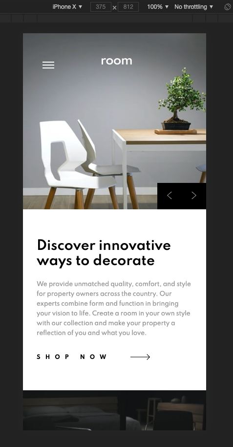

# Frontend Mentor - Room homepage solution

This is a solution to the [Room homepage challenge on Frontend Mentor](https://www.frontendmentor.io/challenges/room-homepage-BtdBY_ENq).

## Table of contents

- [Overview](#overview)
  - [The challenge](#the-challenge)
  - [Screenshot](#screenshot)
  - [Links](#links)
- [My process](#my-process)
  - [Built with](#built-with)
- [Author](#author)
- [Acknowledgments](#acknowledgments)

## Overview

### The challenge

Users should be able to:

- View the optimal layout for the site depending on their device's screen size
- See hover states for all interactive elements on the page
- Navigate the slider using either their mouse/trackpad or keyboard

### Screenshots

### Links

- Solution URL: [https://github.com/jundymek/room-homepage-frontendmentor](https://github.com/jundymek/room-homepage-frontendmentor)
- Live Site URL: [Add live site URL here](https://your-live-site-url.com)

### Built with 🚀

- Semantic HTML5 markup
- CSS custom properties
- Flexbox
- Mobile-first workflow
- [React](https://reactjs.org/) - JS library
- css modules for styles

## Author

- Website - [jundymek](https://jundymek.com)
- Frontend Mentor - [@jundymek](https://www.frontendmentor.io/profile/jundymek)
- Github - [jundymek](https://github.com/jundymek)
